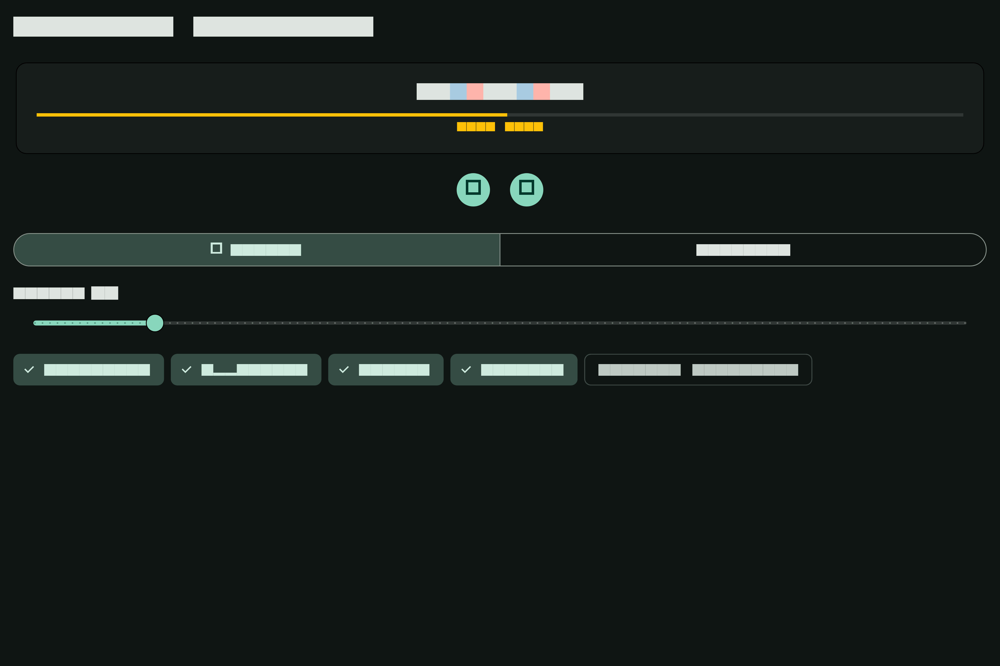

# Hidlins

```
    __  ___    _____
   / / / (_)__/ / (_)___  ___
  / /_/ / / _  / / / __ \/ __|
 / __  / / /_/ / / / / / /__ \
/_/ /_/_/\__,_/_/_/_/ /_/____/
```

Hidlins (Scots: _"in secret, in hiding"_, pronounced _HID-linz_) is an offline-first secrets
manager built on a Rust core with thin cross-platform UIs. Vaults are stored in
the [KDBX (KeePass) format](https://keepass.info/help/kb/kdbx_4.html) via the
[`keepass-rs`](https://crates.io/crates/keepass) crate, so every Hidlins vault
is directly interoperable with KeePassXC, KeeWeb, KeePass2, and other
standards-compliant KDBX clients. Sync transport is S3-compatible object storage,
with in-app three-way merge at the entry level.

The Flutter desktop app is D1 code-complete for macOS and Linux: adaptive
lock/list-detail/generator/settings surfaces, keyboard shortcuts, reduced
motion, real Rust-bridge lifecycle/auto-lock coverage, MinIO two-session sync,
and KeePassXC 2.7.12 interop. Human screen-reader and keyboard-only sign-off is
tracked separately from code completion.

## Desktop app preview

| List + detail (light) | Generator (dark) |
| --- | --- |
|  |  |

The committed golden matrix contains 24 compact/medium/expanded light/dark
states under [`app/test/goldens/`](app/test/goldens/).

## !!WARNING!! PLEASE READ

This repository is a hobby project of a single person (or at best a few people). The author(s) of
this project wish to make the following **VERY** clear:

- This software is provided "AS IS", without warranty of any kind. (See **License** for further
  clarification)

- This software is not designed as enterprise grade security software (note the _hobby project_
  statement above). Users should not expect any sort of specific quality bar or reliability
  with this software.

- **Use at your own risk**. The authors of this software are in no way responsible for your use of
  the software and/or the security of data you store with this software.

- This software is opinionated in how it works. What that mostly means is that it was designed to
  solve the needs of the original author. It may or may not fit your needs.

## Workspace layout

| Crate             | Purpose                                                            |
| ----------------- | ------------------------------------------------------------------ |
| `hidlins-core`    | Library: KDBX I/O, vault registry, atomic writes, file locks, search |
| `hidlins-genpw`   | Library: random password and diceware passphrase generation        |
| `hidlins-security`| Library: auto-lock, OS lock events, clipboard, core-dump suppression |
| `hidlins-sync`    | Library: S3 sync transport, SigV4 signing, three-way merge engine  |
| `hidlins-cli`     | Binary: one-shot scriptable CLI (`hidlins`)                        |
| `hidlins-tui`     | Binary: interactive terminal UI (`hidlins-tui`)                    |
| `hidlins-agent`   | Binary: (placeholder) optional long-running unlock agent           |
| `hidlins-api`     | Library: sole Flutter FFI boundary and session owner                |
| `app/`            | Flutter desktop UI for macOS and Linux                              |

## Supported platforms

Phase 0 targets macOS and Linux on x86_64 and aarch64. Windows, FreeBSD, and
network filesystems are not supported targets for the vault-core reliability
claims.

## Terminal UI

The TUI (`hidlins-tui`) is the reference UX. Launch it with `make run-tui` or
`cargo run -p hidlins-tui --offline --locked`.

### Keybinding presets and rebinding

Two presets ship: **vim** (default) and **plain** (arrow-first, no chords). To
rebind keys, edit `~/.config/hidlins/config.toml`:

```toml
[keymap]
preset = "vim"

[keymap.bindings]
copy-password = "y"          # rebind a single key
search = ["/", "ctrl+f"]     # multiple triggers
pin-toggle = false            # unbind
```

Run `hidlins-tui --dump-keys` to print the effective keymap, or
`hidlins keys` from the CLI.

### Themes

Five built-in themes: `default-dark`, `default-light`, `accessible`, `slate`,
`paper`. Each has an explicit ANSI-16 variant for 16-color terminals. User
themes are TOML files dropped in `~/.config/hidlins/themes/`:

```toml
# ~/.config/hidlins/themes/mint.toml
accent = "#5FFFAF"
match_hl = "#FFD75F"
```

Select a theme in `config.toml` or cycle through them in the Settings tab:

```toml
[theme]
dark = "default-dark"
light = "paper"
mode = "auto"     # "auto" | "dark" | "light"
```

### Search

Open the search overlay with `/` (vim preset) or `Ctrl+F`. Features:

| Key       | Action                                                      |
| --------- | ----------------------------------------------------------- |
| Type      | Fuzzy-filter entries (fzf-style scoring, match highlighting)|
| `Ctrl+S`  | Cycle scope: All / Group / Tag                              |
| `Alt+1..9`| Quick-select result by number                               |
| `Enter`   | Copy password (arms auto-clear) and close                   |
| `Tab`     | Jump to entry in tree (open detail)                         |
| `Esc`     | Close and restore pre-search selection                      |

Configure the default scope and Enter action in `config.toml`:

```toml
[search]
default-scope = "all"      # "all" | "group" | "tag"
enter-action = "copy"      # "copy" | "open"
```

### CLI search modes

```sh
hidlins entry search --vault work "github"                  # substring (default)
hidlins entry search --vault work --mode fuzzy "gh"         # fuzzy matching
hidlins entry search --vault work --scope group:Social "tw" # scoped to group
hidlins entry search --vault work --mode fuzzy --format json "api"  # JSON with score
```

### Other flags

```sh
hidlins-tui --vault work        # skip vault list, open directly
hidlins-tui --theme slate       # override theme
hidlins-tui --no-mouse          # keyboard-only session
hidlins-tui --read-only         # refuse vault mutations
hidlins-tui --config /path      # custom config location
hidlins-tui --dump-keys=json    # print keymap as JSON
```

### Mouse

Mouse is an accelerator: click to select/focus, click tabs to switch, wheel to
scroll. Every mouse action has a keyboard equivalent. Hold Shift while dragging
to use your terminal's native text selection. Disable with `--no-mouse` or
`mouse = false` in `config.toml`.

## Build from source

`make` is the canonical build interface — every workflow has a target. Run
`make` (or `make help`) to list them. The most common:

```sh
make build              # cargo build --workspace --offline --locked
make test               # default-parallel tests
make check              # Rust gate: fmt-check + lint + build + test (no Flutter needed)
make app-check          # Flutter gates: analyze/format/unit/goldens/real bridge/integration/codegen drift
make verify             # everything, including managed MinIO live-wire suites (Docker/Podman required)
make interop            # vault-core KeePassXC interop tests; requires keepassxc-cli >= 2.7
make interop-entry      # entry-management KeePassXC interop tests (TOTP cross-checks with oathtool if present)
make interop-app        # desktop API-boundary KDBX round-trip; KeePassXC 2.7.12+
make app-test-integration-minio # two real desktop sessions against local MinIO
make test-minio-managed # own MinIO lifecycle and run Rust + desktop live-wire suites
make bench-search-gate  # NFR-002 gate: fails if search exceeds the latency budget
```

All dependencies are vendored in `vendor/`; offline is the only supported
build mode. From a clean clone, do not run `cargo update`; use the checked-in
`Cargo.lock` and vendored sources. To intentionally add or upgrade a Rust
dependency, follow the vendoring workflow in [CONTRIBUTING.md](CONTRIBUTING.md)
and run `make vendor` as the only networked dependency step.

## Security and supply chain

See [`CLAUDE.md`](CLAUDE.md)/[`AGENTS.md`](AGENTS.md) for the non-negotiable security and supply-chain
rules: zeroize on drop, no plaintext to disk, atomic writes, permissive-license
deps only, vendored + pinned, no telemetry.

## AI Coding Policy

This repository leverages AI Coding solutions as part of its development processes. The authors of
this repository recognize that some individuals will find that objectionable. We recognize and
appreciate that perspective and wish such individuals the very best in finding a codebase that
fit's their needs.
